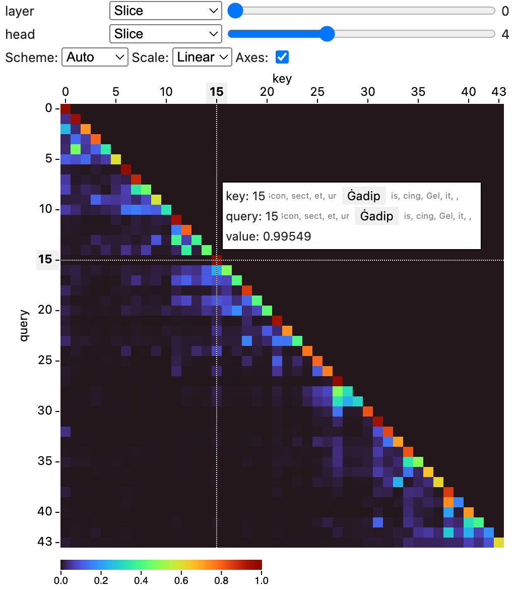

# Tensor Visualizer

This is a package to visualize tensor data in notebooks.



## Install

```bash
pip install tensor-visualizer
```

## Usage

You can use this widget in a notebook to visualize tensor data.
The widget supports numpy `ndarray`s, PyTorch and Tensorflow tensors,
as well as MLX tensors.

```python
from tensor_visualizer import TensorVisualizer

# Visualize a 4-dimensional numpy array.
import numpy as np
data = np.random.randn(5, 10, 10, 10)
widget = TensorVisualizer(data)
widget
```

```python
from tensor_visualizer import TensorVisualizer

# Visualize a 4-dimensional torch tensor.
import torch
data = torch.randn((5, 10, 10, 10))
widget = TensorVisualizer(data)
widget
```

You can name dimensions with the `names` argument:

```python
TensorVisualizer(data, names=["batch", "channel", "height", "width"])
```

and label indices for the dimensions with the `labels` argument:

```python
TensorVisualizer(
    data,
    names=["batch", "channel", "height", "width"],
    labels=[["b1", "b2", "b3"], ["ch1", "ch2"]]
)
```

By default the widget infers the color scale automatically from your data. To configure the color scale, you can set the `scale_domain`, `scale_type`, and `scale_scheme` properties:

```python
# Set the scale domain to [1, 100], log scale,
# and use the viridis color scheme.
w = TensorVisualizer(data, scale_domain=[1, 100], scale_type="log", scale_scheme="viridis")
# You can also set it after creating the widget
w.scale_domain = [0, 1]
```

If you are using inferred scales, you can access the inferred scale properties with `current_scale_domain`, `current_scale_type`, and `current_scale_scheme`. These properties are available only after the widget has been shown.

You may use the `permute` argument the re-order the tensor dimensions in the visualization. For instance, `permute=[2, 0, 1, 3]` shows dimension 2 first, then dimension 0, 1, and 3. The last two dimensions are used in the heatmap.

### Parameters

| Name            | Description                                                                                                                |
| --------------- | -------------------------------------------------------------------------------------------------------------------------- |
| `tensor`        | The tensor to visualize.                                                                                                   |
| `names`         | The names for dimensions in the tensor.                                                                                    |
| `labels`        | Lists of labels for dimensions in the tensor.                                                                              |
| `default_views` | Specify the default views for each dimension, supported options are: `slice`, `small-multiples`, `min`, `max`, and `mean`. |
| `scale_domain`  | Specify the scale domain. If unspecified, the widget will infer the domain automatically.                                  |
| `scale_type`    | Specify the scale type (linear or log). The default is linear.                                                             |
| `scale_scheme`  | Specify the scale color scheme. If unspecified, the widget will infer the scheme automatically.                            |
| `permute`       | Permute the order of the tensor's dimensions.                                                                              |

## Development

This project consists of a Svelte library for the frontend component, and Python code for the widget.

To setup for frontend development, run:

```bash
npm install
npm run dev
```

You'll get a development server (usually at <http://localhost:5173>)
that hosts an demo page of the frontend component.

To build the frontend package, run:

```bash
npm run build
```

To build the Python package, run:

```bash
hatch build
```

To develop the widget, you can start a Jupyter Lab instance and load the example notebooks in the `examples` folder:

```bash
hatch run jupyter lab
```
